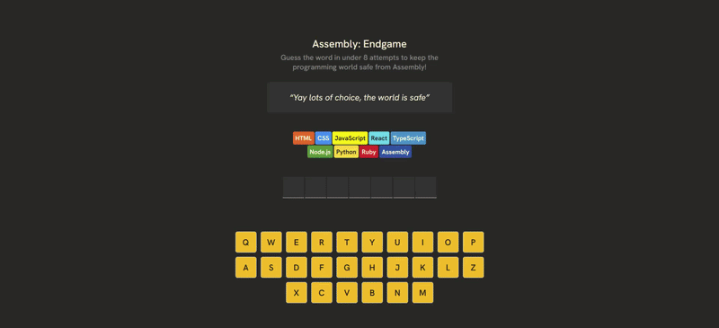

# Assembly: Endgame

A fun word-guessing game built with React. Guess the word in 8 tries or less! 🎮



## What Is This?

A capstone project from [Scrimba's React Basics course](https://scrimba.com/learn/react). It's a playful take on the classic hangman game, built to practice React fundamentals like state management, components, and event handling.

## Play the Game

**[👉 Play Assembly: Endgame Live](https://anik-hindu.github.io/assembly-endgame)**

## How to Play

1. A secret word is hidden
2. Click letters to guess
3. Get it right → letters reveal
4. Get it wrong → you lose an attempt
5. Guess the word before your 8 attempts run out

## Quick Start

```bash
# Install
npm install

# Play locally
npm run dev
```

Then open `http://localhost:5173` in your browser.

## What I Learned

Building this project taught me:

- **React Hooks** — Managing game state with `useState`
- **Props** — Passing data between components
- **Event Handling** — Responding to button clicks
- **Array Methods** — Filtering, mapping, and deduplicating guesses
- **Component Composition** — Breaking the UI into logical pieces

## The Code

```
src/
├── components/          # UI pieces
│   ├── Top.jsx         # Wrong guess counter
│   ├── Letters.jsx     # Hidden/revealed letters
│   ├── Keyboard.jsx    # Clickable letter buttons
│   └── Eliminations.jsx # Visual wrong-guess tracker
├── data/
│   └── words.js        # ~86 fun words to guess
├── utils.js            # Helper functions
├── App.jsx             # Main game logic
└── main.jsx            # Entry point
```

## Stack

- [React](https://react.dev) — UI framework
- [Vite](https://vitejs.dev) — Dev server & build tool
- Vanilla CSS — Styling

## What's Next?

- Add difficulty levels (easy/hard word sets)
- Save high scores with `localStorage`
- Dark mode toggle
- Leaderboard
- More word categories

## Built with ❤️ at [Scrimba](https://scrimba.com)

---

Questions? [Open an issue](https://github.com) or [reach out](mailto:your-email@example.com).

**Status:** ✅ Fully playable
